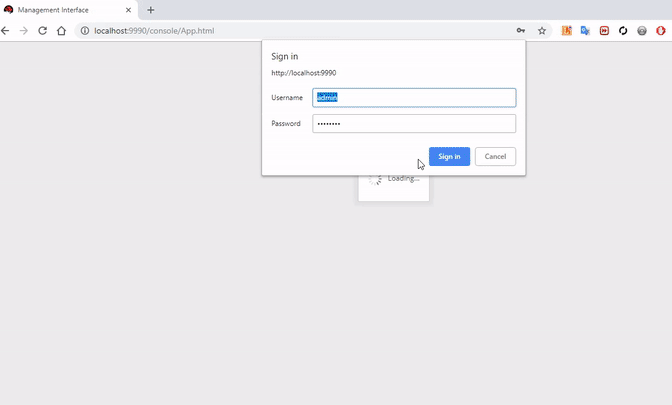

# เครื่องมือที่ใช้
1. jax-rs
2. bootstrap version 4.1.3
3. jquery dataTable version 1.10.18
4. jquery version 3.3.1
5. database h2

### ขั้นตอนการติดตั้ง
1. [download](https://drive.google.com/open?id=167xfQCc9Pnzl8UUC_sQsn9DsPi5SxtxR)

2. แต่ zip ไว้ที่ d: จะได้ folder d:/wildfly-10.1.0.Final

3. start โดย run bat file
```
d:/wildfly-10.1.0.Final/bin/standalone.bat
```

3. เข้าใช้งานโปรแกรม 
```
http://localhost:8080/inventory/index.html
```

### ขั้นตอนการ deploy
user:admin
pass:admin123
